[](https://github.com/gongahkia/mino/releases/tag/1.0.0)
[](https://github.com/gongahkia/mino/releases/tag/2.0.0)

# `Mino`

A minimal Voxel Modeling, Visualization and Animation tool with real-time rendering and a scriptable API.

## Stack

* *Script*: [Python](https://www.python.org/)
* *Frontend*: [React](https://react.dev/), [TypeScript](https://www.typescriptlang.org/), [HTML Canvas API](https://developer.mozilla.org/en-US/docs/Web/API/Canvas_API)
* *Backend*: [Node.js](https://nodejs.org/en), [JavaScript](https://developer.mozilla.org/en-US/docs/Web/JavaScript)
* *Dependencies*: [Pygame](https://www.pygame.org/news), [NumPy](https://numpy.org/)
* *Package*: [Docker](https://www.docker.com/)
* *Test*: [Pytest](https://docs.pytest.org/en/stable/)

## Usage

### CLI

The below instructions are for running `Mino` CLI on your client machine.

1. Execute the below.

```console
$ git clone https://github.com/gongahkia/Mino && cd Mino/cli
```

2. Build and run a Docker Image for [Production](./cli/Dockerfile).

```console
$ docker build -t mino-prod -f Dockerfile .
$ docker run --rm -it -p 8000:8000 mino-prod
```

3. Build and run a Docker Image for [Development](./cli/Dockerfile.dev).

```console
$ docker build -t mino-dev -f Dockerfile.dev .
$ docker run --rm -it -v $(pwd):/app -p 8000:8000 mino-dev
```

4. Build and run [Unit Tests](./cli/tests/).

```console
$ docker build -t mino-dev -f Dockerfile.dev .
$ docker run --rm -it -v $(pwd):/app mino-dev pytest tests/
```

### Web App

1. Execute the below.

```console
$ git clone https://github.com/gongahkia/Mino && cd Mino/web
```

2. Build and run a Docker Image for [both](./web/docker-compose.yml) the Frontend and the Backend.

```console
$ docker-compose build
$ docker-compose up
$ docker-compose up --build
```

3. Access the [Frontend](./web/frontend/) at [localhost:3000](http://localhost:3000) and the [Backend](./web/backend/) at [localhost:4000](http://localhost:4000).

## Architecture

### CLI



```mermaid
flowchart TD
  subgraph Main_Entry["main.py (Entry Point)"]
    MainApp["main.py"]
  end

  subgraph Mino_Package["mino/ (Python Package)"]
    subgraph Core_Module["core.py"]
      Voxel["Voxel (class)"]
      VoxelModel["VoxelModel (class)"]
    end

    subgraph Renderer_Module["renderer.py"]
      Camera["Camera (class)"]
      VoxelRenderer["VoxelRenderer (class)"]
    end

    subgraph API_Module["api.py"]
      MinoModel["MinoModel (class)"]
    end

    subgraph Exporters_Pkg["exporters/"]
      ExportersInit["__init__.py"]
      OBJExporter["obj_exporter.py (export_obj)"]
      STLExporter["stl_exporter.py (export_stl)"]
    end

    subgraph Utils_Module["utils.py"]
      SaveJSON["save_json"]
      LoadJSON["load_json"]
      Clamp["clamp"]
      Lerp["lerp"]
      RGB2Hex["rgb_to_hex"]
      Hex2RGB["hex_to_rgb"]
      Distance3D["distance3d"]
    end

    subgraph UI_Module["ui.py"]
      ColorPicker["ColorPicker (class)"]
      SimpleToolbar["SimpleToolbar (class)"]
    end
  end

  subgraph Examples["examples/"]
    SimpleCube["simple_cube.py"]
    AnimationDemo["animation_demo.py"]
  end

  subgraph Tests["tests/"]
    TestCore["test_core.py"]
    TestRenderer["test_renderer.py"]
    TestExporters["test_exporters.py"]
  end

  subgraph Assets["assets/icons/"]
    Icons["(icon assets)"]
  end

  Requirements["requirements.txt"]

  %% Relationships
  MainApp --> MinoModel
  MainApp --> ColorPicker
  MainApp --> SimpleToolbar
  MainApp --> Requirements

  MinoModel --> VoxelModel
  MinoModel --> VoxelRenderer
  MinoModel --> OBJExporter
  MinoModel --> STLExporter

  VoxelModel --> Voxel

  VoxelRenderer --> Camera
  VoxelRenderer --> VoxelModel

  OBJExporter --> VoxelModel
  STLExporter --> VoxelModel

  ColorPicker --> Clamp
  SimpleToolbar --> Clamp

  VoxelModel --> SaveJSON
  VoxelModel --> LoadJSON

  SimpleCube --> MinoModel
  AnimationDemo --> MinoModel

  TestCore --> Voxel
  TestCore --> VoxelModel

  TestRenderer --> VoxelModel
  TestRenderer --> VoxelRenderer
  TestRenderer --> Camera

  TestExporters --> VoxelModel
  TestExporters --> OBJExporter
  TestExporters --> STLExporter

  MainApp -.-> Icons
  UI_Module -.-> Icons

  %% Labels for clarity
  MainApp -- "uses" --> MinoModel
  MainApp -- "uses" --> ColorPicker
  MainApp -- "uses" --> SimpleToolbar
  MainApp -- "depends on" --> Requirements

  MinoModel -- "wraps" --> VoxelModel
  MinoModel -- "wraps" --> VoxelRenderer
  MinoModel -- "exports to" --> OBJExporter
  MinoModel -- "exports to" --> STLExporter

  VoxelModel -- "contains" --> Voxel

  VoxelRenderer -- "has" --> Camera
  VoxelRenderer -- "renders" --> VoxelModel

  OBJExporter -- "serializes" --> VoxelModel
  STLExporter -- "serializes" --> VoxelModel

  ColorPicker -- "uses" --> Clamp
  SimpleToolbar -- "uses" --> Clamp

  VoxelModel -- "calls" --> SaveJSON
  VoxelModel -- "calls" --> LoadJSON

  SimpleCube -- "demonstrates" --> MinoModel
  AnimationDemo -- "demonstrates" --> MinoModel

  TestCore -- "tests" --> Voxel
  TestCore -- "tests" --> VoxelModel

  TestRenderer -- "tests" --> VoxelModel
  TestRenderer -- "tests" --> VoxelRenderer
  TestRenderer -- "tests" --> Camera

  TestExporters -- "tests" --> VoxelModel
  TestExporters -- "tests" --> OBJExporter
  TestExporters -- "tests" --> STLExporter

  MainApp -.-> Icons
  UI_Module -.-> Icons
```

### Web

```Mermaid

```

## Reference

The name `Mino` is shorthand for "Minus One", loosely referring to `Mino`'s employment of [Voxel Coordinate Compression](https://eisenwave.github.io/voxel-compression-docs/), specifically [SVO](https://en.wikipedia.org/wiki/Sparse_voxel_octree) and [RLE](https://en.wikipedia.org/wiki/Run-length_encoding). `Mino` also happens to be one character away from "Mini", which is a [happy coincidence](https://www.collinsdictionary.com/dictionary/english/happy-coincidence).
